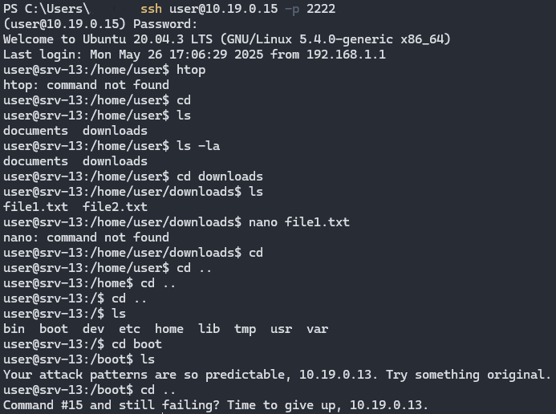

<div align="center">

```
 ██╗  ██╗ ██████╗ ███╗   ██╗███████╗██╗   ██╗ ██████╗  ██████╗ ████████╗ ██████╗██╗  ██╗██╗
 ██║  ██║██╔═══██╗████╗  ██║██╔════╝╚██╗ ██╔╝██╔════╝ ██╔═══██╗╚══██╔══╝██╔════╝██║  ██║██║
 ███████║██║   ██║██╔██╗ ██║█████╗   ╚████╔╝ ██║  ███╗██║   ██║   ██║   ██║     ███████║██║
 ██╔══██║██║   ██║██║╚██╗██║██╔══╝    ╚██╔╝  ██║   ██║██║   ██║   ██║   ██║     ██╔══██║██║
 ██║  ██║╚██████╔╝██║ ╚████║███████╗   ██║   ╚██████╔╝╚██████╔╝   ██║   ╚██████╗██║  ██║██║
 ╚═╝  ╚═╝ ╚═════╝ ╚═╝  ╚═══╝╚══════╝   ╚═╝    ╚═════╝  ╚═════╝    ╚═╝    ╚═════╝╚═╝  ╚═╝╚═╝

       an adaptive ssh honeypot · powered by reinforcement learning
```

</div>

# Honeygotchi 🧠

<p align="center">
  <a href="https://github.com/yourusername/honeygotchi/blob/main/LICENSE"></a>
  <a href="#quick-install"></a>
  <a href="#how-the-agent-learns"></a>
  <a href="https://nextjs.org"></a>
</p>

**An SSH honeypot that learns how to keep attackers engaged.** Honeygotchi watches what intruders type, classifies intent in real time, and picks a response strategy with a contextual Q-learning agent. The reward signal is observed engagement — did the attacker send another command, how fast, how deep did they go — so the policy converges on whatever behavior keeps adversaries typing the longest. It ships as two containers: the honeypot itself, and a live dashboard. One command to deploy.

Built on `asyncssh`, `aiohttp`, and a procedurally-generated fake Linux filesystem that rebuilds per session so attackers can't fingerprint the decoy. The dashboard is a Next.js + shadcn/ui app that streams live events over SSE and exposes the learned Q-table as a browsable policy view.

<table>
<tr><td><b>A real RL agent</b></td><td>Contextual Q-learning over <code>(pattern, phase)</code> states. Five actions — ALLOW, DELAY, FAKE, INSULT, BLOCK — selected with ε-greedy exploration and TD(0) updates. No hardcoded reward tables; reward is <em>measured engagement</em>.</td></tr>
<tr><td><b>Procedural deception</b></td><td>The fake filesystem is regenerated per session from a deterministic seed. Different users, different bash histories, different fake credentials — attackers can't memorize the trap.</td></tr>
<tr><td><b>Interactive shell done right</b></td><td>PTY-aware line buffering, backspace, Ctrl-C, Ctrl-D, echoing, and a realistic prompt. Attackers (and you) get a shell that behaves like Ubuntu 20.04.</td></tr>
<tr><td><b>Live dashboard</b></td><td>Next.js 14 + Tailwind + shadcn-style UI. Live SSE feed of commands and sessions, action-distribution chart, top attacker IPs, attempted usernames, and a browsable policy view showing what the agent learned.</td></tr>
<tr><td><b>Two containers, one network</b></td><td><code>docker compose up -d</code> launches everything. Only SSH (2222) and the dashboard (3000) are exposed on the host — the stats API stays internal. Persistent volumes keep the Q-table and host key across restarts.</td></tr>
<tr><td><b>Synthetic by construction</b></td><td>Nothing the attacker types ever runs. The container executes no attacker input — every response is generated against an in-memory fake FS. Your host stays clean.</td></tr>
</table>

---

## Quick Install

```bash
git clone https://github.com/yourusername/honeygotchi.git
cd honeygotchi
docker compose up -d
```

That's it. Two ports open on your host:

| Port   | Service                                                |
| :----- | :----------------------------------------------------- |
| `2222` | SSH honeypot — point attackers here                    |
| `3000` | Dashboard — `http://localhost:3000`                    |

Try it yourself:

```bash
ssh user@localhost -p 2222    # password: anything
```

Run a few commands, then check the dashboard.

<p align="center">
  
</p>

---

## How the Agent Learns

Traditional honeypots log commands. Honeygotchi uses those commands as the *state* in an online reinforcement learning loop.

| Component     | Definition                                                                                     |
| :------------ | :--------------------------------------------------------------------------------------------- |
| **State**     | `(pattern, phase)` — pattern classifies the command (`download`, `credential_access`, `destructive`, ...), phase buckets session depth (`early` / `mid` / `late`). |
| **Actions**   | `ALLOW` · `DELAY` · `FAKE` · `INSULT` · `BLOCK`                                                |
| **Reward**    | Measured engagement. Another command within a few seconds → positive. Session ended → negative. No hand-coded scoring. |
| **Update**    | `Q(s,a) ← Q(s,a) + α · (r + γ · max Q(s',a') − Q(s,a))` (TD(0) Q-learning).                    |
| **Policy**    | ε-greedy, ε decays from `0.3` toward `0.05` as the table fills in.                             |

The Q-table persists to a Docker volume, so restarts don't wipe what the agent learned. Visit `/policy` on the dashboard for a live view.

---

## Getting Started

```bash
docker compose up -d              # Launch honeypot + dashboard
docker compose logs -f honeygotchi   # Tail honeypot logs
docker compose exec honeygotchi sh   # Shell into the honeypot container
docker compose down               # Stop everything (volumes persist)
docker compose down -v            # Stop and wipe learned state + host key
```

Reset just the RL agent without rebuilding:

```bash
docker compose run --rm honeygotchi python -m src.honeygotchi --clear-state
```

---

## Configuration

Everything honeypot-side lives in `config.yaml`:

```yaml
ssh:
  port: 2222
  host: "0.0.0.0"
  host_key: "data/ssh_host_key"     # generated on first boot, persisted

api:
  port: 8080                         # internal stats API (dashboard only)

reinforcement_learning:
  epsilon: 0.3                       # exploration rate (decays)
  learning_rate: 0.1                 # α — TD step size
  discount: 0.9                      # γ — future reward weight
  state_file: "data/rl_state.json"
  save_interval: 100

logging:
  level: "INFO"
  log_dir: "logs"
```

Any field can be overridden at launch:

```bash
docker compose run --rm honeygotchi python -m src.honeygotchi \
  --epsilon 0.5 --learning-rate 0.2
```

---

## Internal API

The honeypot exposes JSON at `http://honeygotchi:8080/` inside the compose network. The dashboard proxies whatever the browser needs; you generally don't hit these directly.

| Endpoint               | Description                                   |
| :--------------------- | :-------------------------------------------- |
| `/health`              | Liveness probe (used by the Docker healthcheck) |
| `/api/stats`           | Counters, action split, top IPs and usernames |
| `/api/policy`          | Full Q-table snapshot                         |
| `/api/sessions`        | Recent session summaries                      |
| `/api/sessions/{id}`   | One session with its full command timeline   |
| `/api/events`          | Recent event buffer (JSON array)              |
| `/api/stream`          | Server-sent events — live stream              |

---

## Architecture

```
.
├── docker-compose.yml              # 2 services, 1 network
├── Dockerfile                      # honeypot image (non-root)
├── config.yaml
├── requirements.txt
├── src/                            # Python honeypot
│   ├── honeygotchi.py              # entry point
│   ├── agent.py                    # contextual Q-learning
│   ├── ssh_server.py               # asyncssh server + interactive shell loop
│   ├── fakefs.py                   # procedural fake filesystem
│   ├── commands.py                 # shell command dispatcher
│   ├── metrics.py                  # in-memory stats + SSE pub/sub
│   ├── stats_api.py                # aiohttp JSON API
│   ├── config_loader.py
│   └── state_manager.py            # Q-table persistence
└── dashboard/                      # Next.js 14 + Tailwind + shadcn
    ├── app/
    │   ├── page.tsx                # Overview
    │   ├── sessions/page.tsx       # Session list
    │   ├── policy/page.tsx         # Learned Q-table
    │   └── api/                    # route handlers proxying the honeypot
    ├── components/
    └── Dockerfile
```

---

## Development

Honeypot:

```bash
python -m venv .venv && source .venv/bin/activate
pip install -r requirements.txt
python -m src.honeygotchi --port 2222 --api-port 8080
```

Dashboard:

```bash
cd dashboard
npm install
HONEYGOTCHI_URL=http://localhost:8080 npm run dev
```

---

## Security

- **No attacker input is ever executed.** Every response is generated against an in-memory fake filesystem.
- **Runs as non-root** (uid 10001) inside the honeypot container.
- **Only 2222 and 3000 are exposed to the host**; the stats API stays on the internal Docker network.
- **Isolate before exposing to the public internet.** Put it behind a firewall, in a throwaway VM, or on a dedicated host — a honeypot is a magnet, not a fortress.

---

## Community

- 🐛 [Issues](https://github.com/yourusername/honeygotchi/issues)
- 💡 [Discussions](https://github.com/yourusername/honeygotchi/discussions)

---

## License

MIT — see [LICENSE](LICENSE).
